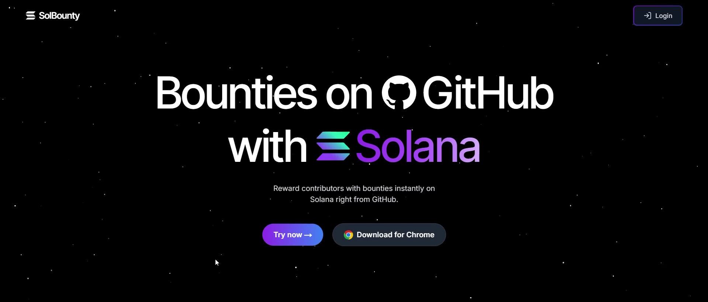
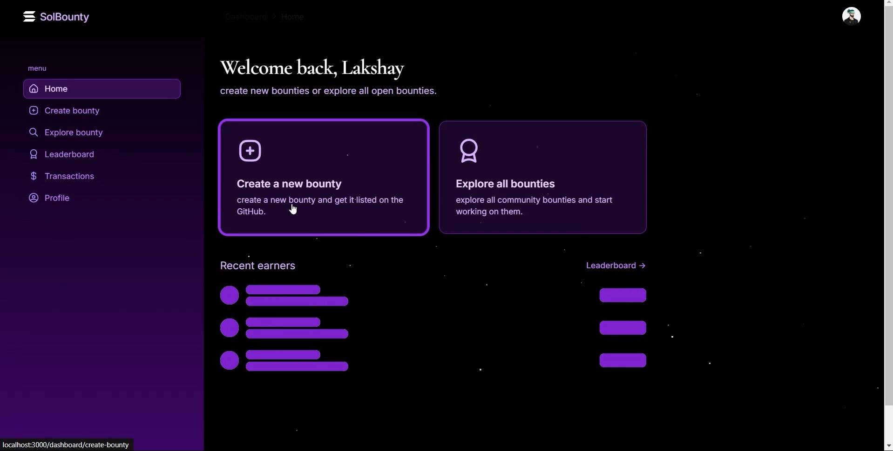
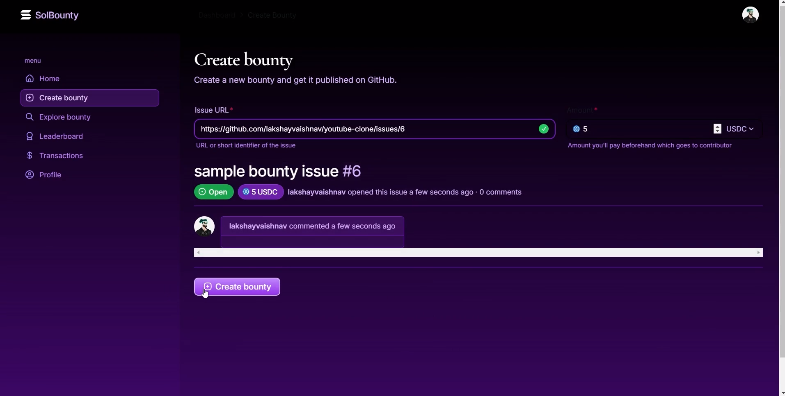
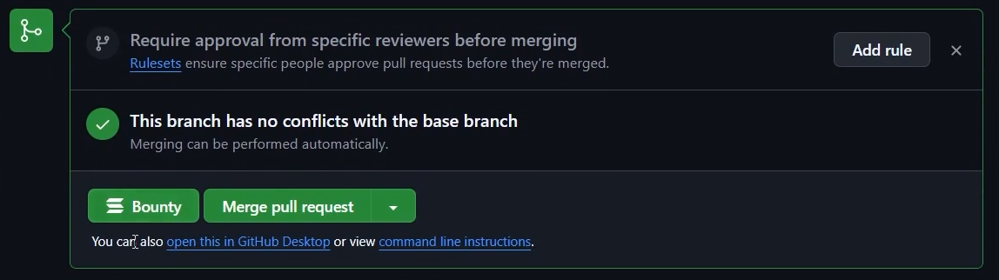

# solbounty
**Reward contributors on github with solana**

Demo Video : [Youtube Link](https://youtu.be/ALOpqNLfKBQ)

SolBounty is a Chrome extension designed to enhance the GitHub experience for both contributors and maintainers. This extension injects a bounty button next to the pull request button on GitHub, allowing maintainers to easily reward contributors for their efforts. The integration creates a seamless workflow, making it easier to recognize and incentivize valuable contributions.
Features
Bounty Button Injection: Automatically adds a bounty button next to each pull request on GitHub.
User-Friendly Interface: Maintainers can easily give bounties without navigating away from the pull request interface.
Seamless Experience: Enhances the existing GitHub workflow, making it more rewarding for contributors.

### Overview

